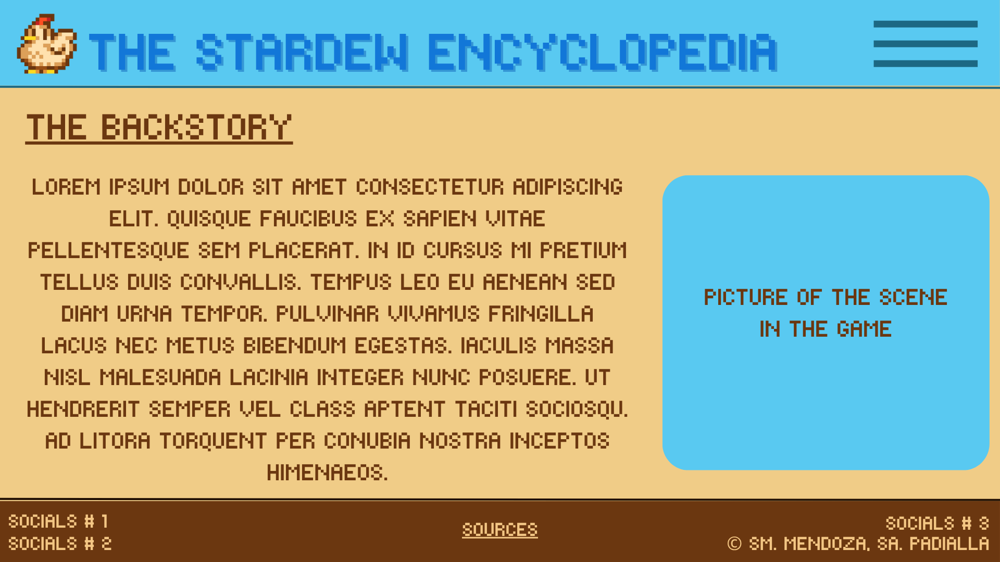
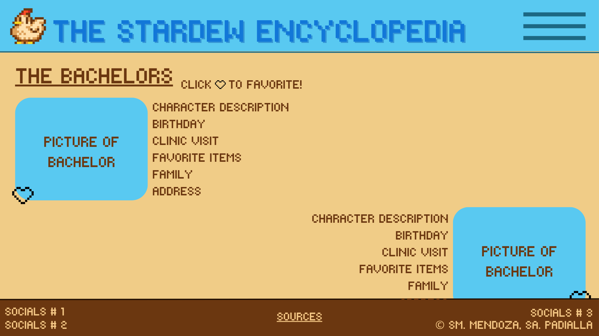
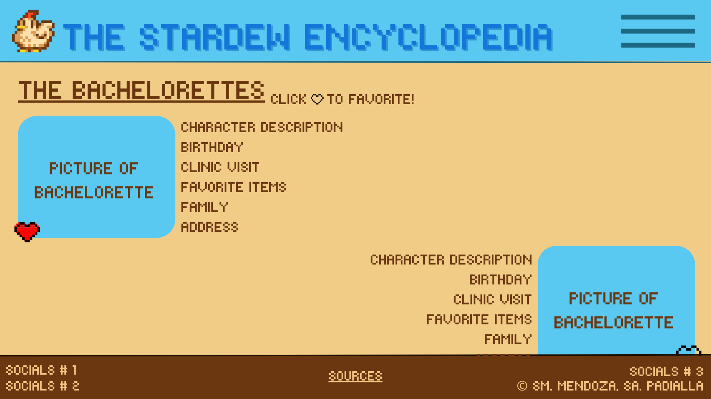

# WDProjLithiumMendozaPadilla

## The Stardew Encyclopedia

******

### Logo:

### Description:
Welcome to the world of Stardew Valley! A game where you can grow and manage your own farm, decorate your home, customize your character, meet new people, and so much more. With countless activities and quests to explore, you’ll never run out of things to do in the valley. 

This website is designed to introduce Stardew Valley to new players and provide helpful insights about the game. You’ll find information about the game’s backstory, the valley itself, the bachelors and bachelorettes, and the many other villagers who make this world come alive.

******

### Webpages:

Home Page:  The Home Page serves as the first page visitors see upon entering the website. It features a brief description of the site and provides links that lead to the Backstory, The Valley, Bachelors, Bachelorettes, and Other Villagers pages.

Backstory Page: This page provides an overview of your Stardew Valley characters’s backstory, accompanied by an image depicting a key scene from the game. It also features a navigation menu located in the top-right corner. When clicked, the menu expands to reveal buttons that link to the other pages of the website.

The Valley: This page showcases the map of Stardew Valley, giving visitors an overview of the entire area. As you scroll down, you can explore detailed descriptions of the different locations found throughout the valley. Each section highlights what makes these places special, who lives there, and how players can interact with them in the game.

Bachelors: This page provides key information about each bachelor, including their favorite gifts, birthdays, homes, and other details. 

Bachelorettes: This page provides key information about each bachelorette, including their favorite gifts, birthdays, homes, and other details. 

Other Villagers: This page features the other interactable villagers in Stardew Valley. Each villager has a short description, along with details about their family, birthday, favorite gifts, and other interesting information. It serves as a helpful guide for getting to know the wider community beyond the bachelors and bachelorettes.

Sources: This page provides all the sources used to make the website.

*Additional information:*
*- Beside each bachelor/bachelorette’s picture, there is a heart-shaped button that allows you to “favorite” your chosen bachelor/bachelorette or bachelors/bachelorettes, making it easier to keep track of your favorites.*
*- On the bottom of each page contains a footer that shows the official social media pages of Stardew Valley as well as copyright for the authors.*

******

### Use of JavaScript in the Project

******

### Wireframes
#### Home Page:

#### Backstory Page:

#### Expanded Backstory Page:

#### The Valley Page:

#### Bachelors Page:

#### Bachelorettes Page:

#### Other Villagers Page:

#### Sources Page:

******

### Link to Canva File (Website Outline)
https://www.canva.com/design/DAG3KJkepFc/iQsnv6U50LsiiV5fGsHExA/edit?utm_content=DAG3KJkepFc&utm_campaign=designshare&utm_medium=link2&utm_source=sharebutton
